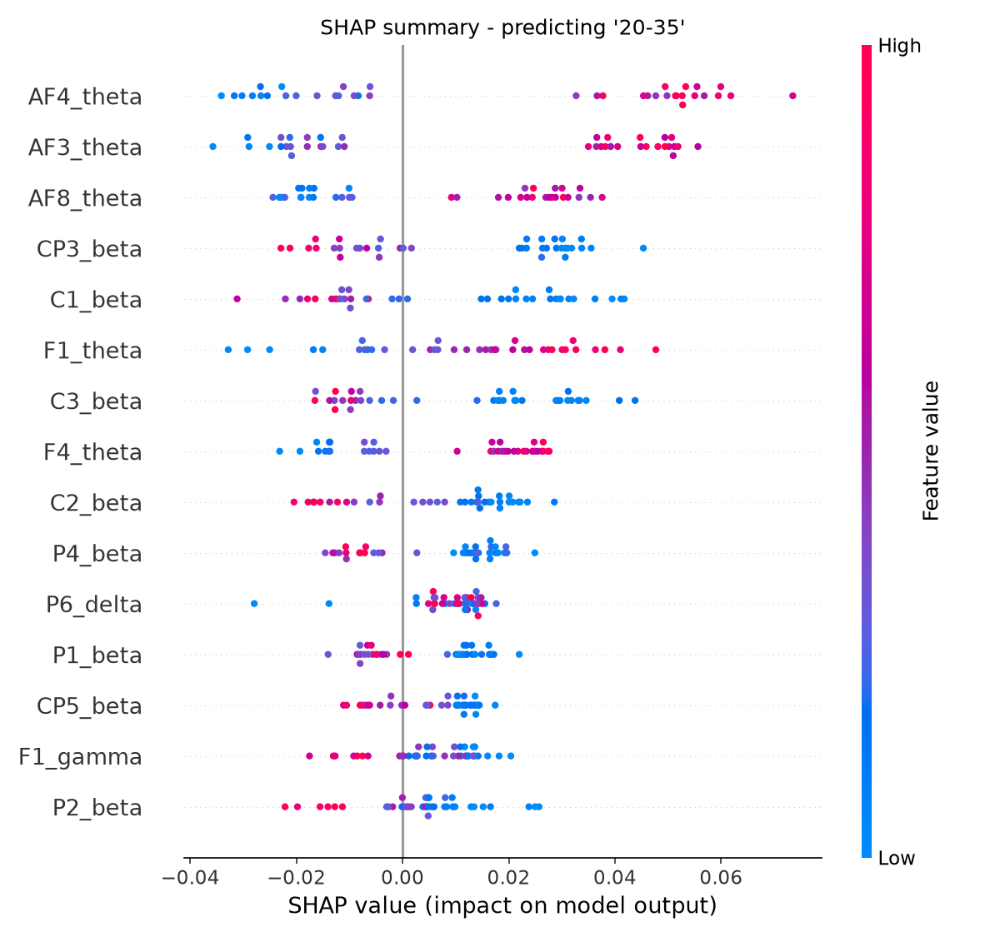

# EEG-Age-Biomarkers

Predicting age group from resting-state EEG using spectral features and a Random Forest classifier, with SHAP-based interpretability to identify the underlying EEG aging signature.

## Motivation

Most EEG age-classification projects stop at reporting an accuracy number. This project goes one step further: using SHAP (SHapley Additive exPlanations) to identify *which* EEG features actually drive the model's predictions, turning a benchmark exercise into a genuine, explainable finding about how the resting brain's electrical activity changes with age.

## Data

This project uses the [MPI-LEMON dataset](https://fcon_1000.projects.nitrc.org/indi/retro/MPI_LEMON.html) (Babayan et al., 2019, *Scientific Data*), a public resting-state EEG dataset from the Max Planck Institute for Human Cognitive and Brain Sciences, Leipzig.

- 62-channel resting-state EEG, eyes-closed condition, ~8 minutes per subject
- Two disjoint age groups by study design: young adults (20-35 years) and older adults (59-77 years) — there is no continuous age range; the study intentionally compares these two clusters
- This repo uses ~190 subjects from the preprocessed (ICA-cleaned) release

Data is **not included** in this repository. To reproduce:
1. Download preprocessed EEG files from the [MPI-LEMON EEG download page](https://fcon_1000.projects.nitrc.org/indi/retro/MPI_LEMON/downloads/download_EEG.html) (Preprocessed Data section)
2. Download the [participant demographics file](https://ftp.gwdg.de/pub/misc/MPI-Leipzig_Mind-Brain-Body-LEMON/Behavioural_Data_MPILMBB_LEMON/) for age labels
3. Extract into `data/` (already excluded from git via `.gitignore`)

## Methods

1. **Loading & preprocessing** (MNE-Python): load eyes-closed `.set`/`.fdt` files, bandpass filter 1-45 Hz, segment into 2-second epochs, discarding any epoch overlapping a data discontinuity.
2. **Feature extraction**: compute power spectral density per epoch (Welch's method), average across epochs, then compute **relative** band power (delta, theta, alpha, beta, gamma) per channel — each band expressed as a fraction of that channel's total power. Relative power was used instead of absolute power because absolute EEG power varies substantially between individuals for reasons unrelated to age (skull thickness, scalp conductivity, electrode contact); relative power normalizes this out.
3. **Labeling**: subjects grouped into three age-range classes based on the study's age bins: `20-35`, `59-70`, `70-77`.
4. **Classification**: Random Forest classifier (`class_weight="balanced"` to account for class imbalance), 80/20 train/test split.
5. **Interpretability**: SHAP `TreeExplainer` computed on the trained model to identify which channel × band features drive predictions for each age group.

## Results

- **Accuracy**: 0.74 (34-38 held-out test subjects)
- Per-class performance (precision / recall): `20-35` 0.85 / 0.85, `59-70` 0.50 / 0.57, `70-77` 0.33 / 0.25
- The youngest group is classified reliably; performance on the two older sub-groups is weaker, consistent with those groups having fewer available subjects (74 total older participants in the source study, split across two classes)

### Key finding: frontal theta power is the strongest age-related signal



SHAP analysis identified relative theta-band power at frontal electrodes (AF4, AF3, F1, AF8) as the most important features driving the model's predictions. The direction is consistent across age groups: **higher frontal theta power pushes predictions toward the youngest group, while lower frontal theta power pushes predictions toward the oldest group.**

This matches published aging research: resting frontal/medial theta power is well-documented to decline with healthy aging (Cummins & Finnigan, 2007; age-related theta studies in *Frontiers in Aging Neuroscience* and elsewhere). This project's model independently rediscovered a real, previously documented neurophysiological pattern from raw EEG data — a meaningful sanity check that the pipeline captures genuine brain signal rather than noise.

## How to run

```bash
python3 -m venv venv
source venv/bin/activate
pip install -r requirements.txt

python3 src/build_dataset.py   # loads, preprocesses, extracts features, builds labeled dataset
python3 src/train_model.py     # trains and evaluates the classifier
python3 src/interpret.py       # runs SHAP analysis, saves summary plots
```

## Repo structure

```
eeg-aging-biomarkers/
├── README.md
├── requirements.txt
├── .gitignore
├── data/                        # not committed — see Data section above
│   └── participants_lemon.csv   # demographics/labels (small, tracked)
├── src/
│   ├── build_dataset.py         # data loading, preprocessing, feature extraction, labeling
│   ├── train_model.py           # train/test split, model training, evaluation
│   └── interpret.py             # SHAP interpretability analysis
└── results/
    ├── labeled_dataset.csv
    └── figures/
        └── shap_summary_*.png
```

## License

MIT